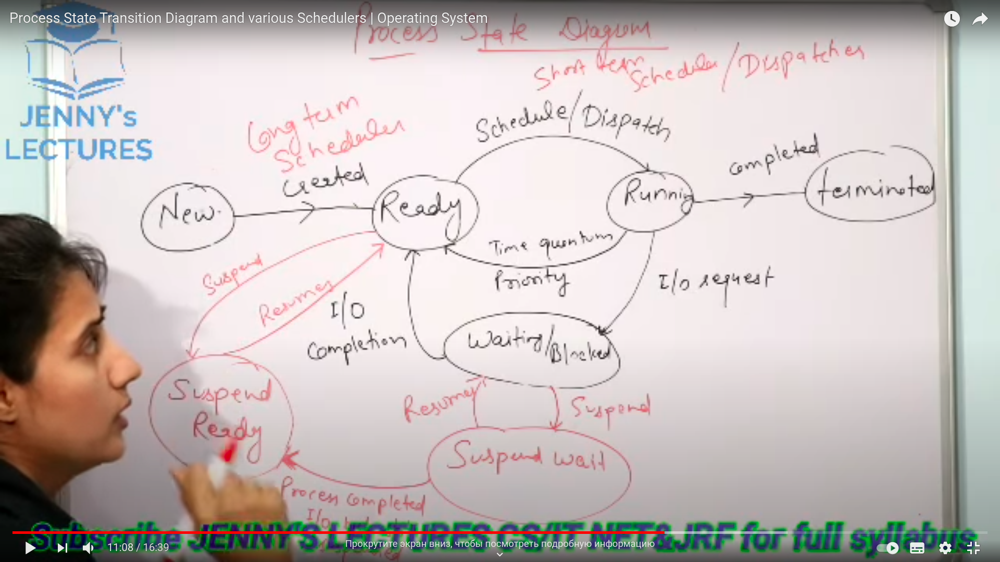

[[Process states]]

NEW - waiting to be put into queue
READY - process waites to be executed on CPU
RUNNING - executing on CPU
WAITING/BLOCKED - waiting for external call to complete(e.g., IO operation)
TERMINATED - finished its execution
SUSPEND WAIT - moved to swap from WAITING/BLOCKED states
SUSPEND READY - moved to swap from READY states

first 5 states take place in the main memory, whereas the other two on secondary memory

longterm scheduler- called on putting proccess from NEW to READY states
middleterm scheduler - called when a proccess is swapped out/in
shortterm scheduler - dispatches proccess from READY to RUNNING state and vice versa

ST > MT > LT

[[Memory management]]
Physical memory - addressed used by the hardware(DMA, peripherals)
Virtual memory - addresses used by software

MMU - Memory-management-unit is the hardware responsible for implementing Virtual memory:
- maps memory accesses using virtual addresses to system RAM
- maps accesses using virtual addresses to memory-mapped peripheral hardware
- handles permissions
- generates an exception (page fault) on an invalid access
  - unmapped addresses or insufficient permissions

TLB - Translation Lookaside Buffer - part of MMU
Is list of mappings from virtual to Physical address space in hardware, holds permission bits
There are fixed number of entries in the TLB
it is a buffer for memory Translations

MMU consults TLB on mappings.
If there are no mappings or not suffient permissions then MMU will create a page fault and interrupt CPU

Page fault cases:
- the virtual address is not mapped for the proccess requesting 
- The proccess has insufficient permissions for the address
- The virtual address is valid, but swapped out

Virtual address space split
- the upper part is for the kernel
- the lower part for user space

Three kins of virtual addresses:
- kernel
  - Logical address
  - virtual
- user space
  - user virtual address

Kernel Logical addresses:
fixed offset from their physical addresses. simple mapping to physical memory.
allocated by kmalloc(). can never be swapped out
Virtually contiguous regions are by nature also physically contiguous